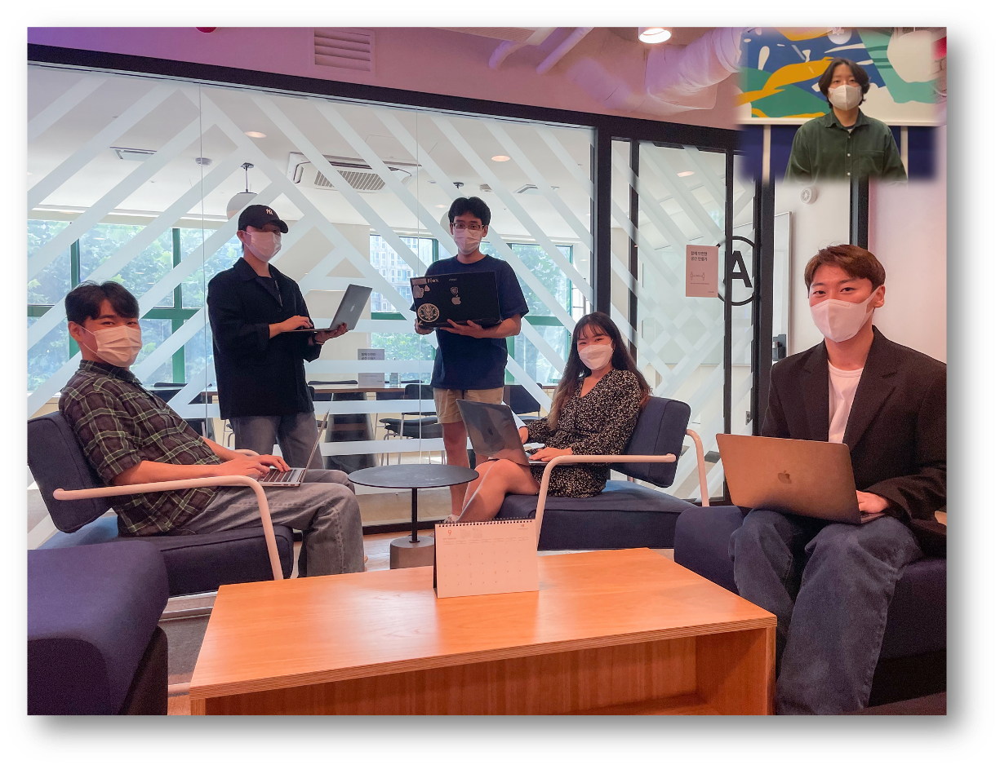

##

---

# ATCHAPEDIA | 앗차피디아

- 앗차피디아 API 메인 서비스 : 
1. Atchapedia에 등록된 영화들의 상세정보를 제공합니다.
2. Atchapedia 회원이 시청한 영화의 평점 및 리뷰 댓글을 등록 및 제공합니다. 
3. 회원이 감상한 총 영화시간, 총 별점 점수, 선호장르, 선호국가, 평가한 영화 등의 리스트를 한눈에 볼 수 있습니다.

  

---

## WATCHAPEDIA | 왓챠피디아

- [왓챠피디아](https://pedia.watcha.com/ko-KR) 사이트

## 팀원

- Front-end: 김영현, 김영호, 김태수 
- Back-end: 성우진, 손명희, 이무현

## 개발 기간

- 기간: 2021년 8월 30일 ~ 2021년 9월 10일(12일간) 

## 적용 기술

- Back-end: Django, Python, MySQL, jwt, bcrypt, AWS RDS, AWS EC2
- 협업툴: Trello, Slack, Github(Rebase), AQuery

## 영상

[앗차피디아 구현 영상](https://www.youtube.com/watch?v=vPYDDjZ-I3k)

## 구현 기능 및 개인 역할

`성우진`
-   추후 업데이트 예정

`손명희`
- CommentView : 영화 리뷰 등록 및 List comprehension을 활용한 리뷰 조회기능 구현
- MovieView   : Q객체, order_by, distinct, offset, limit을 활용한 영화리스트 조회 기능 구현

`이무현`
- Loginview, Login_decorator : 로그인 로직 구현 및 jwt 통한 인증/인가
- RateView : 사용자의 영화 평점 업데이트 및 영화 평균 평점 aggregate을 통해 반환
- GenreMovieView : 영화와 관련된 장르의 영화 필터링하여 반환, 쿼리 최적화 진행
- MyPageView : 마이페이지 구현(데코레이터로 사용자 확인), select_related 통한 쿼리 최적화

## EndPoint

[post] SignUpView        : /users/signup  

[post] Login             : /users/login  

[post] RateView          : /moives/<int:movie_id>/user-rate  

[post] CommentView       : /moives/<int:movie_id>/comments  

[get] RateView           : /moives/<int:movie_id>/user-rate  

[get] CommentView        : /moives/<int:movie_id>/comments  

[get] MyPageView         : /users/mypage  

[get] MovieView          : /moives  

[get] MovieView          : /movies?country=한국  

[get] MovieView          : /movies?country=외국  

[get] MovieView          : /movies?genre1=&genre2=  

[get] MovieView          : /movies?rating=0  

[get] GenreMovieView     : /moives/related-movies?id=2  

[get] MovieDetailView    : /moives/<int:movie_id>  

## Modeling

## 소감 및 후기

- 성우진: ([후기](https://업로드후수정.com)-개인 벨로그)

- 손명희: ([후기](https://mymelody.tistory.com/140)-개인 블로그)

- 이무현: ([후기](https://업로드후수정.com)-개인 벨로그)

## 레퍼런스

- 이 프로젝트는 [왓챠피디아](https://pedia.watcha.com/ko-KR) 사이트를 참조하여 학습목적으로 만들었습니다.
- 실무수준의 프로젝트이지만 학습용으로 만들었기 때문에 이 코드를 활용하여 이득을 취하거나 무단 배포할 경우 법적으로 문제될 수 있습니다.
- 이 프로젝트에서 사용하고 있는 사진 대부분은 위코드에서 구매한 것이므로 해당 프로젝트 외부인이 사용할 수 없습니다.
